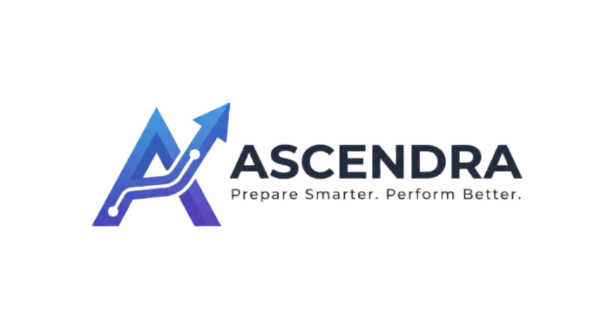

<div align="center">



# Ascendra

### *Prepare Smarter. Perform Better.*

**An AI-powered multimodal placement readiness platform leveraging Natural Language Processing, Deep Learning, Computer Vision, and Speech Processing to help candidates prepare for real-world recruitment processes through adaptive interviews, coding assessments, ATS analysis, AI-powered group discussions, and personalized learning roadmaps.**


</div>

---

# 🚀 Overview

Ascendra is a next-generation AI-powered placement readiness platform designed to simulate real-world recruitment experiences using multimodal artificial intelligence.

Unlike traditional interview preparation platforms, Ascendra evaluates not only what candidates say but also how they communicate by combining Natural Language Processing, Deep Learning, Computer Vision, and Speech Processing. The platform generates adaptive interviews, conducts coding assessments, facilitates AI-powered group discussions, predicts interview readiness, and provides explainable feedback with personalized learning roadmaps.

---

# ✨ Features

- 📄 Resume Analysis
- 🎯 ATS Compatibility Evaluation
- 💼 Job Description Based Interview Generation
- 🤖 Adaptive AI HR Interviews
- 💻 Technical Coding Assessments
- 👥 AI-Powered Group Discussions
- 🎙 Speech & Voice Analysis
- 😊 Emotion Recognition
- 👀 Eye Contact & Head Pose Detection
- 🧠 Multimodal Interview Performance Prediction
- 📊 Detailed Performance Analytics
- 🛣 Personalized Learning Roadmaps
- 📈 Interview History & Progress Tracking

---

# 🛠 Tech Stack

## Frontend

- React
- Vite
- Tailwind CSS
- Axios
- React Router DOM

---

## Backend

- FastAPI
- Python

---

## Database

- PostgreSQL

---

## Artificial Intelligence

### Natural Language Processing

- Hugging Face Transformers
- Sentence Transformers
- spaCy

### Deep Learning

- PyTorch
- TensorFlow

### Computer Vision

- OpenCV
- MediaPipe

### Speech Processing

- OpenAI Whisper
- Librosa

### Multimodal Learning

- Custom Interview Performance Prediction Network (IPPN)

---

# 📂 Project Structure

```text
ASCENDRA/
│
├── frontend/
│
├── backend/
│
├── ai/
│   ├── computer-vision/
│   ├── deep-learning/
│   ├── multimodal/
│   ├── nlp/
│   └── speech/
│
├── database/
│
├── datasets/
│
├── assets/
│   ├── icons/
│   ├── images/
│   ├── logo/
│   └── screenshots/
│
├── .gitignore
└── README.md
```

---

# 🎯 Core Modules

- Authentication
- Candidate Profile
- Resume & ATS Analyzer
- Job Description Analyzer
- AI Interview Engine
- Technical Coding Assessment
- AI Group Discussion
- Speech Intelligence
- Computer Vision Analytics
- Multimodal Interview Performance Prediction
- Personalized Learning Roadmap
- Interview Feedback Dashboard

---

# 🧠 Ascendra Interview Intelligence Pipeline (AIIP)

```text
Candidate Profile
        │
Resume + ATS Analysis
        │
Job Description Understanding
        │
Adaptive Interview Generation
        │
Speech Processing
        │
Computer Vision Analysis
        │
NLP Answer Evaluation
        │
Deep Learning Based Multimodal Fusion
        │
Interview Performance Prediction
        │
Personalized Feedback
        │
Learning Roadmap
```

---

# 🎯 Vision

To build an intelligent placement readiness platform capable of understanding technical knowledge, communication skills, confidence, behavioral traits, and interview performance through multimodal artificial intelligence.

---

# 📌 Project Status

🚧 Currently Under Development

---

# 👨‍💻 Team

<div align="center">

**Tanay Shah**

**Priy Thakor**

</div>

---

<div align="center">

### Prepare Smarter. Perform Better.

Built with ❤️ using Artificial Intelligence, Deep Learning, Natural Language Processing, Computer Vision, and Modern Web Technologies.

</div>